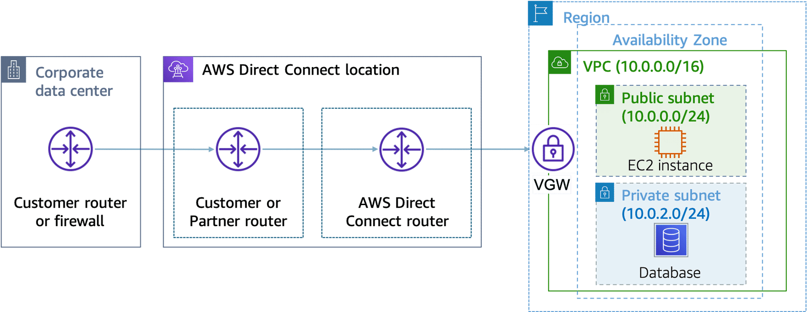

## 🛡️ Amazon VPC (Virtual Private Cloud)

### 📌 What is a VPC?

- An **isolated network** you create in AWS.
- Like a **traditional data center network** , but in the cloud.
- You **define** :
  - 🏷️ **Name**
  - 🌎 **Region** (VPC spans **all Availability Zones** in that region)
  - 🌐 **IP range** (CIDR notation: e.g., `/16` to `/28`)
    

---

### 🧱 Subnets: Building Blocks Inside a VPC

- **Subnets** divide your VPC into **smaller sections** (like VLANs).
- Subnets are tied to **specific Availability Zones (AZs)** .
- You can create:
  - 🌐 **Public Subnet** – For resources needing internet access.
  - 🔒 **Private Subnet** – For internal-only resources.

> 🎯 Example:
>
> - VPC CIDR: `10.0.0.0/16`
> - Subnet CIDR: `10.0.0.0/24` in AZ-1

---

### ♻️ High Availability with VPC

- AWS best practice: Use **at least two subnets in different AZs** .
- Reason: **Redundancy** and **Fault Tolerance** .
- Remember: _“Everything fails all the time.”_ – plan for it!

---

### 📵 Reserved IPs

- AWS **reserves 5 IP addresses per subnet** :
  - Network address
  - VPC router
  - DNS server
  - Future use
  - Broadcast address
- Example: In a `/24` subnet (256 IPs), only **251 usable** .

---

### 🌐 Gateways in AWS Networking

#### 1. 🌍 Internet Gateway (IGW)

- Connects your **VPC to the internet** .
- Highly available & **scales horizontally** .
- Attach it to your VPC to enable internet access.

#### 2. 🔐 Virtual Private Gateway (VGW)

- Used to connect to **on-premise private networks** via VPN.
- Requires a **Customer Gateway (CGW)** on your end.
- Enables **encrypted VPN** communication.
  

#### 3. ⚡ AWS Direct Connect

- Provides a **dedicated physical connection** to AWS.
- Bypasses the public internet = **more secure & faster** .
- Ideal for **high-throughput, low-latency** workloads.
  

---

### 🧠 Cloud Engineer Insights

- Choose **/16** for VPC → Gives you **65,536 IPs** , future-proof.
- Use **/24** subnets → Each has 256 IPs; easy to manage.
- Think in **AZ pairs** for high availability.
- For internet access:
  - EC2 instance must be in **public subnet**
  - Subnet must have **route to IGW**
  - Instance must have **public IP or Elastic IP**
- Keep **private subnets** for databases, backend services.
- Use **NAT Gateways** for private subnet outbound internet access.

---

### 📚 Resources

- [📘 What Is Amazon VPC?](https://docs.aws.amazon.com/vpc/latest/userguide/what-is-amazon-vpc.html)
- [📘 How Amazon VPC Works](https://docs.aws.amazon.com/vpc/latest/userguide/how-it-works.html)
- [🔗 AWS Site-to-Site VPN](https://docs.aws.amazon.com/vpn/latest/s2svpn/VPC_VPN.html)
- [🔗 AWS Direct Connect](https://docs.aws.amazon.com/directconnect/latest/UserGuide/Welcome.html)
