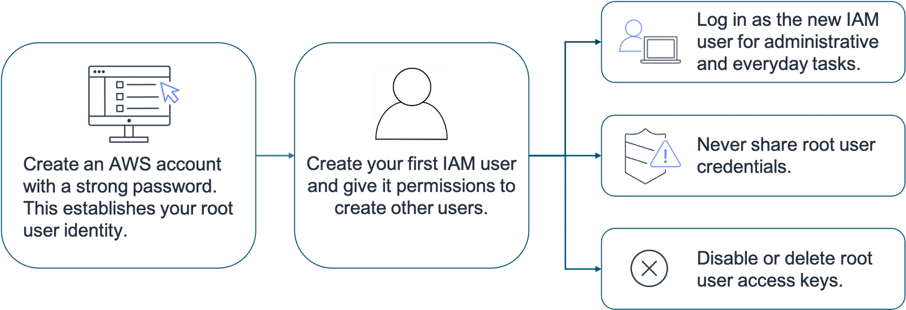
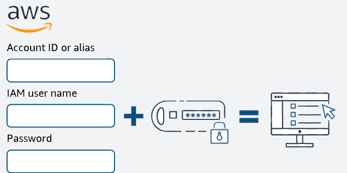

## 🛡️ Protecting the AWS Root User

### 👤 What is the AWS Root User?

* The **root user** is created when you first create an AWS account.
* It has **full access** to all AWS services and resources, including  **billing** .
* It’s accessed via the **email and password** used during account creation.

---

### 🔐 AWS Root User Credentials

* **2 types of credentials** :

1. **Email + Password** — used for AWS Management Console.
2. **Access Keys** — used for CLI/API programmatic access.
   * Consist of:
     * Access Key ID (e.g., `A2lAl5EXAMPLE`)
     * Secret Access Key (e.g., `wJalrFE/KbEKxE`)

> 🛑  **Important** : Access keys are like a **username & password** combo. Treat them securely.

---

### ⚠️ Access Key Management Best Practices

* ❌ **Don’t create access keys** for root unless absolutely required.
* ✅ **Delete root access keys** if already created:
  * Navigate to **My Security Credentials**
  * Go to **Access Keys**
  * Click **Delete**

---

### ✅ Root User Best Practices

| Best Practice                               | Why It Matters                    |
| ------------------------------------------- | --------------------------------- |
| 🔑 Use a**strong password**           | Harder to brute-force             |
| 📱 Enable**MFA**                      | Adds a 2nd layer of security      |
| 🔐**Never share**root credentials     | Prevent unauthorized access       |
| ❌**Delete/disable**root access keys  | Minimizes exposure                |
| 👥 Create**IAM users**for daily tasks | Practice**least privilege** |

> 👨‍💼  **Cloud Insight** : The root user should only be used for account-level tasks like closing an account or managing billing settings. For  **operational activities** , always use IAM users with scoped permissions.

---

## 🔐 Multi-Factor Authentication (MFA)

### 🔄 What is MFA?

* MFA = Two or more authentication methods to verify identity.
* Three categories:
  * 📘  **Something you know** : password or PIN
  * 🔑  **Something you have** : OTP device or app
  * 👁️  **Something you are** : biometric (fingerprint, face)

> 🎯 Even if your password is compromised, MFA provides  **additional protection** .

---

### 🧰 Supported MFA Methods on AWS

| Type                   | Description                     | Examples                    |
| ---------------------- | ------------------------------- | --------------------------- |
| 📱 Virtual MFA         | App that generates codes        | Google Authenticator, Authy |
| 🔐 Hardware TOTP Token | Device that generates codes     | Key fob, Display card       |
| 🔒 FIDO Security Keys  | Hardware-based key with USB/NFC | Yubico (FIDO Certified)     |

> 🛡️  **Cloud Pro Tip** : For highly secure environments, use **FIDO security keys** for phishing-resistant MFA.

---

## 🧠 Summary

* Use the root account  **only when absolutely necessary** .
* **Enable MFA** to protect your AWS account.
* **Never** share or expose root credentials or access keys.
* Set up **IAM users** and **roles** to perform administrative and operational tasks.

---

### 📚 Resources

* [AWS MFA Guide](https://docs.aws.amazon.com/IAM/latest/UserGuide/id_credentials_mfa.html)
* [Enabling MFA (Virtual/Hardware/FIDO)](https://docs.aws.amazon.com/IAM/latest/UserGuide/id_credentials_mfa_enable.html)
* [Root User Required Tasks](https://docs.aws.amazon.com/accounts/latest/reference/root-user-tasks.html)
