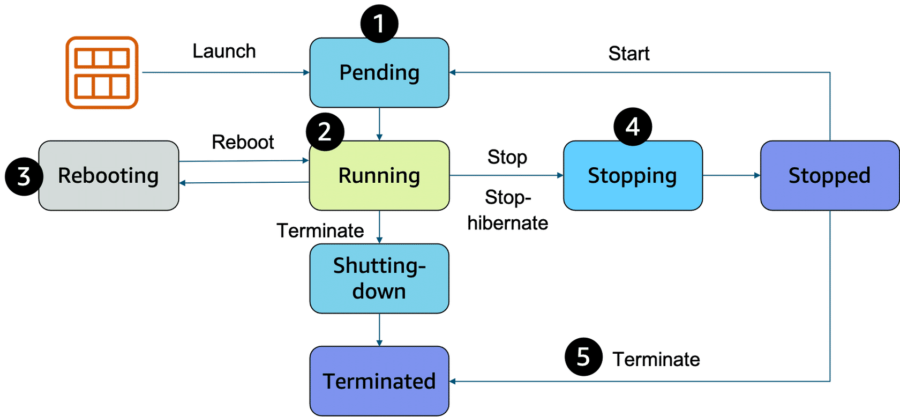

## 🌀 **Amazon EC2 Instance Lifecycle**

### 1. **Pending**

- **What Happens:** AWS sets up the instance—allocating network, copying AMI to the root.
- **Billing:** ❌ Not charged.
- **State:** Initialization/preparation phase.

### 2. **Running**

- **What Happens:** Instance is active and usable.
- **Billing:** ✅ Charges start.
- **Actions Possible:** Reboot, Stop, Stop-Hibernate, Terminate.

### 3. **Reboot**

- **Like OS Reboot:** Instance restarts but retains:
  - Public & Private IPv4
  - IPv6 (if assigned)
  - Instance store data (if present)

### 4. **Stop / Stop-Hibernate**

- **Stop:**
  - Shuts down like a laptop.
  - **Billing:** No compute charges, **but EBS** charges continue.
  - **IP:** Retains private IP.
  - **RAM Data:** ❌ Lost.
- **Stop-Hibernate:**
  - Saves RAM to **EBS volume** .
  - **Faster start** later.
  - Works **only if hibernation prerequisites** are met.

### 5. **Terminated**

- **Resources Freed:** IPs and instance store lost.
- **Billing Stops** when the status is **shutting down** or **terminated** .
- **Cannot recover** once terminated.

---

## 💰 **EC2 Pricing Models**

| Pricing Option         | Key Features                                                                                    | Use Cases                                                                |
| ---------------------- | ----------------------------------------------------------------------------------------------- | ------------------------------------------------------------------------ |
| **On-Demand**          | - Pay per sec/hour`- No upfront`- Flexible scaling                                              | - Short-term, spiky workloads`- Dev/test environments`- First-time users |
| **Spot Instances**     | - Up to 90% cheaper`- Interruptible`- Price fluctuates based on demand                          | - Fault-tolerant apps``- Big data, CI/CD, test environments              |
| **Savings Plans**      | - 1- or 3-year commitment``- Flexible usage across instance families and regions                | - Steady workloads``- Users who want flexibility with commitment         |
| **Reserved Instances** | - Reserve capacity`- Up to 72% savings`- Term: 1 or 3 years``- Standard, Convertible, Scheduled | - Predictable workloads``- Long-running apps needing guaranteed capacity |
| **Dedicated Hosts**    | - Physical server allocated`- Use own licenses`- Meet compliance                                | - License management``- Regulatory/compliance needs                      |

---

## 🧠 **Pro Tips from a Cloud Specialist**

- **Stop ≠ Terminate** : Stopping keeps data on EBS, while terminating deletes ephemeral storage.
- **Hibernate is ideal** for **quick boot-up** in dev/test environments but has limitations (e.g., instance type, EBS config).
- **Use Spot for batch jobs** (e.g., video rendering, ML training) where interruptions won’t cause issues.
- **Combine Savings Plans with Auto Scaling** for cost efficiency + flexibility.
- **Reserved Instances** are great for steady workloads—lock in capacity and cost.

---
